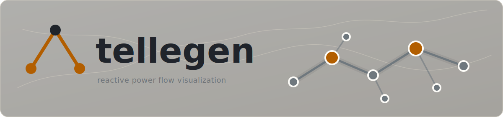

<p align="center">
  
</p>

# tellegen

Reactive visualization for power systems optimization. The name refers to
Tellegen's theorem and the adjoint sensitivity calculations used by
PowerDiff.jl.

tellegen uses a gradient preview, exact commit interaction model. Perturbations
update the display from KKT sensitivity columns. Exact DC OPF commits run in the
browser through Rust, Clarabel, and WebAssembly; bundled cases can fall back to
the Rust server using the same solver path. Case parsing uses
[powerio](https://github.com/eigenergy/powerio). PowerDiff.jl remains as a
reference harness for parity checks.

Full documentation is published with mdBook at
[eigenergy.github.io/tellegen](https://eigenergy.github.io/tellegen/). The
source lives in [docs/src/SUMMARY.md](docs/src/SUMMARY.md).

## Demo Behavior

The bundled demo serves three TAMU ACTIVSg synthetic grids at the geographic
coordinates stored in their PowerWorld aux exports. These are fictional grids
on geographic footprints, not surveyed infrastructure:

| case | territory | buses | branches |
|---|---|---:|---:|
| ACTIVSg200 | central Illinois | 200 | 245 |
| ACTIVSg500 | South Carolina | 500 | 597 |
| ACTIVSg2000 | Texas | 2000 | 3206 |

Each case is an islanded DC OPF instance. Bus color shows locational marginal
price. Selecting a bus shows the dLMP/dd column for a demand perturbation at
that bus. Moving the demand slider applies the local sensitivity immediately;
releasing it computes the exact solution with Clarabel in WebAssembly. Bundled
cases can fall back to the Rust server if browser solve is unavailable.

Dropped `.m`, `.raw`, and `.aux` files are parsed in the browser by the
WebAssembly build of powerio. Files with coordinates render on the map. Files
without coordinates can be placed by clicking the map, or paired with local
coordinate sidecars in `.csv`, `.json`, or `.geojson` form. A dropped PowerWorld
`.pwd` file is decoded as display data and rendered as approximate substation
positions. Parsed local case files solve in the browser and are not uploaded.

## Development

Backend:

```sh
cargo run --manifest-path rust/Cargo.toml --bin tellegen-server
```

WebAssembly module:

```sh
cd frontend
npm run wasm
```

Frontend:

```sh
cd frontend
npm install
npm run dev
```

The Vite dev server proxies `/api` to `http://localhost:8000`.

## Data

The TAMU distributions are downloaded by the operator and are not vendored.
With the distributions under `~/Datasets`:

```sh
scripts/stage-data.sh ~/Datasets
```

The script stages the six files used by the demo into `data/`. Without all
three staged cases, the server exits. For CI or local smoke checks without the
TAMU distributions, set `TELLEGEN_ALLOW_FALLBACK=1` to serve the two pglib
fallback cases with synthetic coordinates.

## Tests

The served sensitivity columns are KKT derivatives at the optimum. Rust tests
cover the solver, the sensitivity columns, and the HTTP API:

```sh
cargo test --manifest-path rust/Cargo.toml
```

The Julia reference harness remains available for PowerDiff.jl parity checks:

```sh
julia --project=reference/julia-backend reference/julia-backend/test/runtests.jl
```

Frontend checks:

```sh
cd frontend
npm run check
npm run build
npm run smoke:build
```

## Repository layout

- `frontend/`: SvelteKit 5 static app, MapLibre GL, deck.gl
- `rust/`: Rust crate, WebAssembly parser/solver, and native HTTP server
- `reference/julia-backend/`: Julia PowerDiff.jl parity harness
- `scripts/`: data staging and docs build helpers
- `deploy/`: deployment compose files and proxy notes
- `docs/src/`: mdBook documentation source

## Documentation

Install mdBook, then build the docs:

```sh
scripts/build-docs.sh
```

## API

- `GET /api/health`
- `GET /api/cases`
- `GET /api/cases/{id}/case`
- `GET /api/cases/{id}/network`
- `GET /api/cases/{id}/solution`
- `GET /api/cases/{id}/sensitivity/lmp/d/{bus}`
- `GET /api/cases/{id}/solve`

The sensitivity and server solve endpoints accept `?d=bus:mw,bus:mw`, where each
value is a MW delta from the base case. The solve stream emits `status`,
`solution`, optional `sensitivity`, and `done` events.

Server solve work is bounded by `TELLEGEN_SOLVER_CONCURRENCY` (default `2`) and
`TELLEGEN_SOLVER_TIMEOUT_SECS` (default `30`).

## Deployment

Local development uses the build based `docker-compose.yml`:

```sh
docker compose up -d --build
```

Production deployment uses the image based compose file in
`deploy/docker-compose.prod.yml`. The GitHub Actions deploy workflow builds and
pushes `ghcr.io/eigenergy/tellegen:<sha>`, restarts the host container, and
checks both the local host health endpoint and the public demo URL. Required
secrets are documented in [docs/src/deployment.md](docs/src/deployment.md).

## Roadmap

- library packaging with `@sveltejs/package`
- canonical display data in powerio
- AC operands and AC solver paths as the browser numerical stack matures

## License

MIT
