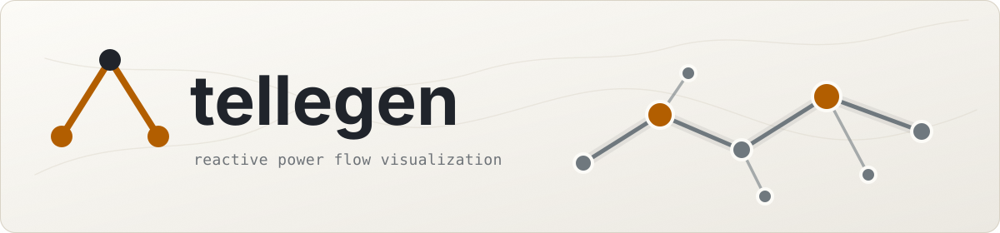

<p align="center">
  
</p>

# tellegen

Browser visualization for DC OPF, AC power flow, SOCWR, and their sensitivities.
Demand and rating edits preview through KKT sensitivity columns and commit as
fresh solves in WebAssembly. Case parsing uses
[powerio](https://github.com/eigenergy/powerio). The project is named for
Tellegen's theorem.

Live demo: [tellegen.dev](https://tellegen.dev). Documentation:
[eigenergy.github.io/tellegen](https://eigenergy.github.io/tellegen/).

## Packages

```sh
npm install @tellegen/engine   # case parsing and wasm solves, framework agnostic
npm install @tellegen/svelte   # map, panels, and solve card as Svelte components
npm install @tellegen/webmcp   # WebMCP tools and host adapter contract
```

`@tellegen/engine` exports case parsing, browser solving, the `Study` preview
and commit calls, sensitivities, and generated TypeScript types.
`@tellegen/svelte` exports the map, panels, local file flow, and solve card.
`@tellegen/webmcp` exports the general OPF tools and the conditionally
registered `propose_capacity_plan` and `apply_capacity_plan` tools through an
adapter that does not depend on a UI framework. The hosted demo connects the
live Svelte controller to that adapter. See the
[WebMCP guide](docs/src/webmcp.md).
Start with the
[framework quickstart](https://eigenergy.github.io/tellegen/framework-quickstart.html);
`examples/browser-minimal/` and `examples/svelte-minimal/` are working
integrations of each package.

### Rust

The solver itself is the [tellegen](https://crates.io/crates/tellegen) crate.
The packages above are WebAssembly bindings over it, so a Rust consumer skips
them and calls it directly. Case parsing stays in
[powerio](https://crates.io/crates/powerio).

```sh
cargo add tellegen powerio serde_json
```

```rust
use tellegen::{solve_instance, SolveRequest};

let parsed = powerio::parse(powerio::Source::open("case30.m")?, None)?;
let network_module = tellegen::ir::balanced_module(parsed)?;
let instance = powerio::DcOpfInstance::from_network(network_module.value.clone())?;

// A DC OPF with bus 2 shifted 50 MW, and the LMP column against demand.
let request: SolveRequest = serde_json::from_str(
    r#"{
        "formulation": "dcopf",
        "edits": { "deltas": { "2": 50.0 } },
        "sensitivities": [
            { "operand": {"Price":"Active"}, "parameter": {"Demand":"Active"} }
        ]
    }"#,
)?;

let solved = solve_instance(&instance, &request).map_err(|e| e.to_string())?;
println!("{:?} objective {:?}", solved.status, solved.objective);
```

`solve_module_json` takes and returns JSON strings for callers that hold a
stored PowerIO module. It accepts modules containing a balanced network or a
declared problem instance; it does not accept bare network JSON. Default
features carry the differentiable engine: DC OPF, AC power flow, and the KKT
sensitivities. `conic` adds the SOCWR relaxation and its sensitivities.
`--no-default-features` drops faer and num-complex and leaves the DC OPF solve
on its own.

`tellegen-cli` wraps the same call for scripting: it reads a stored PowerIO
module on stdin and writes the solve response to stdout. Its `solve-module`
command writes an exact PowerIO solution module.

## Demo

The demo serves three TAMU ACTIVSg synthetic grids and the CATS California
Test System. These are synthetic networks on geographic footprints, not
surveyed infrastructure:

| case        | territory        | buses | branches |
| ----------- | ---------------- | ----: | -------: |
| ACTIVSg200  | central Illinois |   200 |      245 |
| ACTIVSg500  | South Carolina   |   500 |      597 |
| ACTIVSg7000 | Texas            |  6717 |     9140 |
| CATS        | California       |  8870 |    10823 |

Bus color is locational marginal price. Selecting a bus shows ∂LMP/∂demand at
that bus; selecting a binding line shows ∂LMP/∂rating. Dragging a slider
applies the sensitivity column live; releasing it re-solves exactly in
WebAssembly. A selector switches the formulation between DC OPF and SOCWR.

Dropped `.m`, `.raw`, `.aux`, `.epc`, `.pwb`, `.dss`, and recognized JSON cases
parse in the browser and never upload. Files with coordinates render in place;
files without can be placed by clicking the map or paired with `.csv`, `.json`,
or `.geojson` geography (powerio's GeoLayer reader; branch routes render as
polylines). A PowerWorld `.pwd` file renders as approximate substation
positions, or fills a sibling case without coordinates through its substation
numbers. Saved PowerIO modules and exports carry the placement, and the layout
downloads as a `.geo.json` layer.

## Development

Prerequisites: Rust from [rust-toolchain.toml](rust-toolchain.toml) with
`rustfmt`, `clippy`, and the `wasm32-unknown-unknown` target; Node.js 22 or
newer; `wasm-pack` 0.15.x; mdBook 0.5.x for docs.

```sh
# backend with the embedded fallback cases
TELLEGEN_ALLOW_FALLBACK=1 cargo run -p tellegen-server

# frontend demo (the dev server proxies /api to localhost:8000)
npm ci
npm run wasm
npm run build:engine
npm run build:webmcp
npm run build:svelte
npm --workspace tellegen-frontend run dev
```

Tests:

```sh
cargo test --workspace
npm run check && npm run build && npm run smoke:web && npm run test:downstream
```

Case data comes from the operator, not the repository. With the ACTIVSg and
CATS distributions under `~/Datasets`, `scripts/stage-data.sh ~/Datasets`
stages the complete cases into `data/`; the server serves whatever is staged.

## Repository layout

- `crates/`: Rust workspace — `tellegen` (engine), `tellegen-wasm` (WebAssembly), `tellegen-server` (HTTP), `tellegen-cli`, `benchmarks`
- `packages/engine/`: `@tellegen/engine` browser package
- `packages/svelte/`: `@tellegen/svelte` component package
- `packages/webmcp/`: reusable WebMCP tools, validation, and registration
- `apps/web/`: the hosted demo, a SvelteKit consumer of the Svelte package
- `examples/`: minimal Vite and Svelte integrations of each package
- `docs/src/`: mdBook source; `scripts/build-docs.sh` builds it

The [HTTP API](https://eigenergy.github.io/tellegen/http-api.html),
[deployment](https://eigenergy.github.io/tellegen/deployment.html), and
[roadmap](https://eigenergy.github.io/tellegen/direction.html) pages cover the
server surface, hosting, and where the project is going.

## License

[MIT](LICENSE). See
[docs/src/third-party-notices.md](docs/src/third-party-notices.md) for
attributions.
