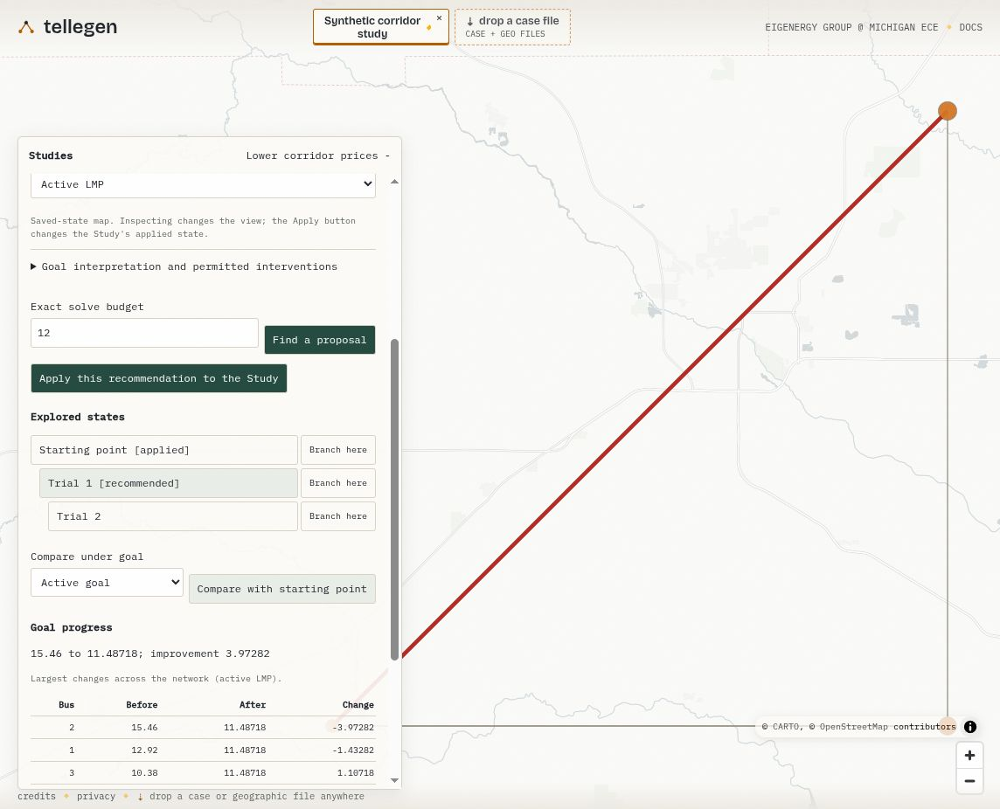

# Native WebMCP Study evidence

The call records capture the built application through the browser's native
WebMCP capability on 2026-09-05. No WebMCP polyfill or test harness supplied the
recorded tool calls. The case server supplies a synthetic three-bus network,
illustrative coordinates and an initial exact native solve. Subsequent edits
and Studies solve in WASM; remote compute is disabled.

`manifest.json` identifies source revisions and hashes the inputs, results,
call records, screenshots and WASM assets. The electrical fixture is the
repository's MIT-licensed `CASE3_PLANNING` example. `input.pio.json` and
`initial-solution.json` retain the exact numerical input used for this capture.

## Reproduce

Build the application with `npm run wasm`, `npm run build:engine`,
`npm run build:webmcp` and `npm run build:web`, then run:

```sh
python evidence/studies/serve_native_demo.py
```

Open `http://127.0.0.1:4186` in a WebMCP-enabled browser. Use the inputs in
`calls.json`, resolving newly generated session, Study, state and goal IDs from
each response. Revisions and immutable record hashes are checked by the app;
recorded IDs are evidence, not commands to replay blindly.

The initial native response can be reproduced with:

```sh
tellegen '{}' < evidence/studies/native-webmcp/input.pio.json
```

## Observations

1. `update_case` reduces line 2-3's rating from 60 MW to 48 MW and solves it.
2. `create_study` captures that state and a bus-2 price objective, with 5 MW
   capacity increments and a 20 MW budget.
3. `propose_study` accepts a 5 MW upgrade: bus-2 price changes from
   15.4600000036 to 11.4871794903. The 10 MW alternative offers no verified
   additional improvement. The planning operation uses three exact solves,
   in addition to the Study creation solve.
4. Comparison shows prices falling at buses 1 and 2 and rising at bus 3.
   Selecting Trial 1 changes the inspected state while the starting state
   remains applied. The visible Apply button then explicitly applies Trial 1.
5. Reload and `inspect_study` restore revision 5 and its applied candidate.
6. `branch_study` returns inspection to the starting state. A new goal revision
   permits conserved demand transfers; it clears the old recommendation and
   retains the applied capacity candidate and earlier goal history.
7. Demand planning accepts a -5/+5 MW transfer from bus 2 to bus 3, reducing
   the objective to 11.4871794890. The next paired transfer is below tolerance.
   A replay with a stale revision is rejected.
8. `record_study_evidence` links the exact-price and demand-conservation check
   to its recommendation without adding an electrical state. Revision 10 has
   five saved states: starting point, two capacity trials and two demand trials.

The search termination `no_verified_improvement` describes why it stopped after
an accepted move. It does not erase the best verified recommendation. These
bounded searches make no global-optimality claim. Browser tests separately
exercise portable import/export, stale approvals, failed saves, cancellation
and native/WASM parity.


